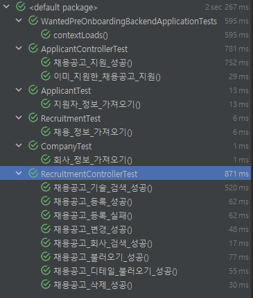
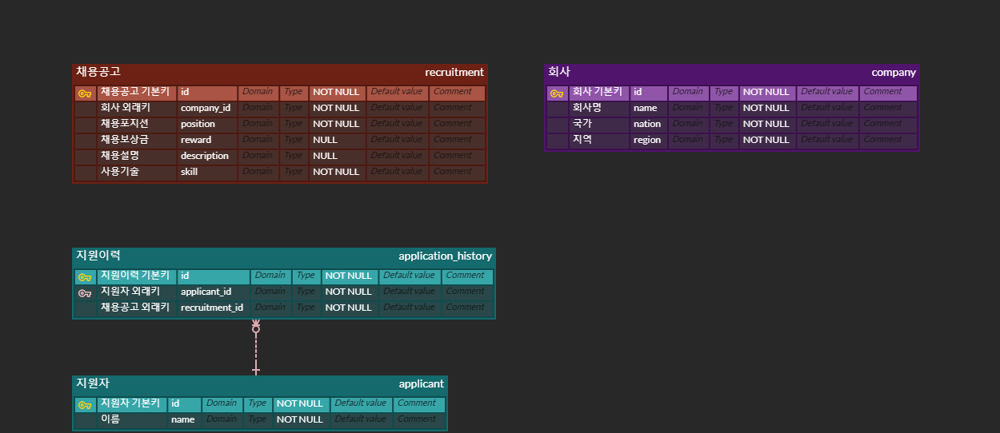

# Wanted pre onboarding backend
## Description
원티드 프리온보딩 코스 백엔드 과제입니다.
### 과제 설명
채용 사이트의 REST API를 구성하는 것이 목표이며, Restdocs와 Hateoas를 통해 Restful API 3단계를 충족하는 API를 만드는 것을 목표로 함.
채용 사이트의 주요 기능은 다음과 같습니다.

#### 요구 사항
**회사**

- 회사는 채용공고를 생성할 수 있음
  - 채용공고는 회사ID, 포지션, 보상금, 내용, 사용기술을 포함함
- 채용 공고를 수정할 수 있음
  - 회사 ID를 제외하고 모두 수정이 가능하다
- 채용 공고를 삭제할 수 있음

**사용자**
- 채용공고의 목록을 가져올 수 있음
- 회사명, 사용기술을 통해 채용공고의 검색할 수 있음
- 채용 상세 페이지를 가져올 수 있음
  - 채용 내용이 추가적으로 담긴다
  - 해당 회사가 올린 다른 채용공고가 추가적으로 포함된다.
- 채용공고에 지원할 수 있음
  - 사용자는 1회만 지원이 가능하다
  - 채용공고 id, 사용자 id가 들어간다

## Statcks
### Enviroment


### Development


## Getting Started
```shell
./gradlew build
cd build/libs
java -jar wanted-preonboarding-0.0.1-SNAPSHOT.jar
```

## Test
```shell
./gradlew test
```

## Proejct Introduce
### TDD
테스트 주도적인 개발을 하기 위해서 노력했다. MockMvc를 통한 통합 테스트 중심으로 통해 개발을 진행하면서 실패 -> 통과하는 코드 -> 리팩토링을 한 통과하는 코드 작성을 반복했다. 코드의 중복을 제거하고, 코드의 가독성을 높이는 것을 목표로 했다.

### Tree
``` 
├─main
│  ├─java
│  │  └─com
│  │      └─wanted
│  │          └─preonboarding
│  │              ├─domain
│  │              │  ├─applicant
│  │              │  │  ├─controller
│  │              │  │  ├─dto
│  │              │  │  ├─entity
│  │              │  │  ├─exception
│  │              │  │  ├─repository
│  │              │  │  └─service
│  │              │  ├─company
│  │              │  └─recruitment
│  │              └─global
│  │                  ├─config
│  │                  └─error
│  │                      └─exception
│  └─resources
```
domain, global 패키지를 기준으로 구성했다. domain 패키지는 채용공고, 지원자, 회사와 관련된 패키지이며, global 패키지는 전역적으로 사용되는 패키지이다.

### Entity Relationship Diagram 



JPA는 객체 그래프 탐색을 통해 연관 탐색을 계속 진행할 수 있지만 채용공고, 지원자 그리고 회사 엔터티가 연관 탐색을 통해 연결해 사용하는 것은 그래프 탐색의 오용이라고 생각했다. 각 엔터티의 책임과 역할을 생각했을 때 연관관계를 명확하게 끊는 것이 옳다고 생각했고 DDD의 에그리거트 단위가 다르면 객체 탐색을 끊는 쪽으로 방향을 지었다.

### Service Layer
#### 행위 기반 네이밍
`RecruitmentService`와 같이 역할을 알 수 없는 서비스가 아닌 `RecruitmentQueryService`, `RecruitmentQueryService`와 같이 행위 기반 네이밍을 통한 역할과 책임을 나누기 위해 노력했습니다.


### Query Search
#### QueryDsl
동적 검색이 필요한 부분에는 QueryDsl을 사용했다. JPA의 Criteria를 보다 쉽게 사용할 수 있으며 QueryDsl을 사용하면 동적 검색을 위한 방대한 Sql을 작성할 필요가 없다.
##### 사용자 정의 리포지토리
기존 JPA에 사용한 Repository에 MemberRepositoryCustom을 상속 받아 Implementaion파일에서 QueryDsl을 통한 동적 쿼리 작성

### Restful API
#### Restful API 3단계?
> Level 3 : Hypermedia As Engine of Application State
>> 응답에는 리소스의 URI를 포함한 링크를 넣어 새로운 기능에 접근할 수 있도록 하는 것

문서화에 사용할 도구를 Swagger와 Restdocs 둘 중 많은 고민을 했지만 코드에 영향을 주지않고 테스트 주도적으로 문서화를 진행할 수 있는 Restdocs를 선택했다. Restdocs를 사용하기 위해선 Spring HATEOAS를 사용해야 했고, HATEOAS를 사용하기 위해선 Restful API를 만족해야 했다. 따라서, 해당 API는 Self-descriptive Message와 HATEOAS를 만족하는 RESTful API 3단계이다.

프로젝트를 배포 후, http://localhost:8080/docs/index.html 로 접속하면 Restdocs를 통해 API 문서를 확인할 수 있다. 혹은,[여기](src/main/resources/static/docs/example/index.html)를 클릭해 해당 Restdocs를 다운받아 볼 수 있습니다.